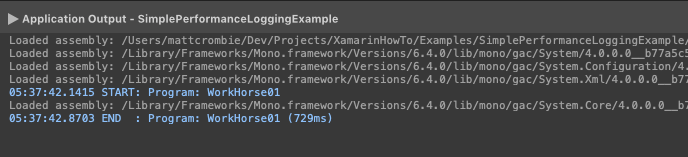

# Introduction 

This solution contains a working example for a Debug Performance Timer Logger.

# Demo



# Usage 
```csharp
public static void Main(string[] args)
{
    using (new DebugPerformanceTimerLogger("Do all the field work that needs doing"))
    {
        WorkHorse01();

        WorkHorse02();

        WorkHorse03();
    }

    using (new DebugPerformanceTimerLogger("Now do 3x as much!"))
    {
        for (var i = 1; i <= 3; i++)
        {
            using (new DebugPerformanceTimerLogger($"Do more work run: {i}"))
            {
                WorkHorse01();

                WorkHorse02();

                WorkHorse03(i);
            }
        }
    }

    // Get overall summary
    DebugPerformanceTimerLogger.GetSummary();
}

private static void WorkHorse01()
{
    using (new DebugPerformanceTimerLogger())
    {
        Thread.Sleep(500);
    }
}

private static void WorkHorse02()
{
    using (new DebugPerformanceTimerLogger())
    {
        Thread.Sleep(750);
    }
}

private static void WorkHorse03(int howMuchWork = 1)
{
    using (new DebugPerformanceTimerLogger($"Horse 3 gets a special description with the multiplier of 100 x {howMuchWork}"))
    {
        Thread.Sleep(100 * howMuchWork);
    }
}
```